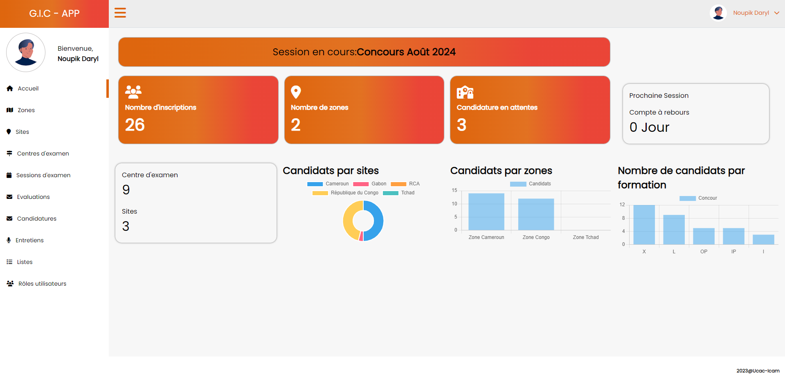

# GIC-APP [AdminUcacDashboard]


GIC-APP / AdminUcacDashboard est une application Angular développée pour la gestion des inscriptions, des entretiens, des centres d'examen, des sessions d'examen, et des sites des utilisateurs de l'application. Tout cela dans le but d'améliorer et de digitaliser le processus des entretiens du concours d'entrée à l'UCAC-ICAM.

## Authors

- Daryl NOUPIK
- Sadjo MOHAMMADOU
- Christian KEPYA
- Providence Djekoudakom
- Stephane SENGTOU

## Table des Matières

- [Structure du Projet](#structure-du-projet)
- [Prérequis](#prérequis)
- [Installation](#installation)
- [Lancer l'application](#Lancer-l-application)
- [Code scaffolding](#Code-scaffolding)
- _Coming soon_
- [Fonctionnalités](#fonctionnalités)

  - [Connexion](#connexion)
  - [Inscription](#inscription)

- [Configuration](#configuration)
- [Contribuer](#contribuer)
- [Licence](#License)

## Structure du Projet

```
AdminUcacDashboard/
├── .angular/                   # Configuration spécifique à Angular CLI
├── .vscode/                    # Configuration spécifique à Visual Studio Code
├── dist/                       # Répertoire de sortie des builds
├── node_modules/               # Dépendances npm installées
├── src/                        # Répertoire source du projet
│   ├── app/                    # Contient les composants et modules de l'application
│   │   ├── centre-examen-page/ # Module pour la gestion des centres d'examen
│   │   ├── home/               # Module de la page d'accueil avec plusieurs sous-modules
│   │   │   ├── admin-home/     # Sous-module pour la page d'accueil administrateur
│   │   │   ├── comptable-home/ # Sous-module pour la page d'accueil comptable
│   │   │   ├── jury-home/      # Sous-module pour la page d'accueil jury
│   │   │   ├── super-admin-home/ # Sous-module pour la page d'accueil super administrateur
│   │   │   ├── home-routing.module.ts # Fichier de routage pour le module home
│   │   │   ├── home.component.html   # Template HTML du composant home
│   │   │   ├── home.component.spec.ts # Tests unitaires du composant home
│   │   │   ├── home.component.ts      # Composant TypeScript de la page d'accueil
│   │   │   ├── home.module.ts         # Module Angular pour la page d'accueil
│   │   ├── login/               # Module pour la gestion de l'authentification
│   │   ├── menu-candidature/    # Module pour la gestion des candidatures
│   │   │   ├── add-candidature/ # Sous-module pour l'ajout de candidatures
│   │   │   ├── gestion-admis/   # Sous-module pour la gestion des candidats admis
│   │   │   ├── gestion-admissible/ # Sous-module pour la gestion des candidats admissibles
│   │   │   ├── gestion-solvable/ # Sous-module pour la gestion des candidats solvables
│   │   │   ├── liste-candidature/ # Sous-module pour la liste des candidatures
│   │   │   ├── candidature.service.spec.ts # Tests unitaires pour le service de candidature
│   │   │   ├── candidature.service.ts      # Service pour la gestion des candidatures
│   │   ├── menu-entretien/       # Module pour la gestion des entretiens
│   │   │   ├── calendrier-disponibilite/ # Sous-module pour le calendrier de disponibilité
│   │   │   ├── calendrier-entretien/ # Sous-module pour le calendrier des entretiens
│   │   │   ├── define-note-interview/ # Sous-module pour définir les notes d'entretien
│   │   │   ├── gestion-disponibilite/ # Sous-module pour la gestion des disponibilités
│   │   │   ├── intervenant-entretien/ # Sous-module pour les intervenants des entretiens
│   │   │   ├── note-entretien/   # Sous-module pour les notes des entretiens
│   │   │   ├── note-summary/     # Sous-module pour le résumé des notes
│   │   │   ├── periode-entretien/ # Sous-module pour les périodes d'entretien
│   │   │   ├── schedule-disponibility/ # Sous-module pour la planification des disponibilités
│   │   │   ├── schedule-interview/ # Sous-module pour la planification des entretiens
│   │   │   ├── visualize-interview/ # Sous-module pour la visualisation des entretiens
│   │   │   ├── menu-evaluation/  # Module pour l'évaluation des candidats
│   │   │   ├── gestion-epreuve/  # Sous-module pour la gestion des épreuves
├── .editorconfig               # Configuration de l'éditeur de code
├── .gitignore                  # Fichiers à ignorer par Git
├── angular.json                # Configuration Angular CLI
├── package.json                # Fichier de configuration npm
├── README.md                   # Documentation du projet
├── tsconfig.json               # Configuration TypeScript
└── tslint.json                 # Configuration TSLint

```

## Prérequis

### Outils

Avant de commencer, assurez-vous d'avoir les éléments suivants :

```
Node.js (v14.x ou version ultérieure)
Angular CLI (v13.3.9 ou version ultérieure)
npm (v6.x ou version ultérieure)
```

## Installation

1. Clonez le depot

```
https://github.com/kepya/UcacIcamManager.git
```

2. Accedez au repertoire :

```
cd UcacIcamManager
```

3. Installer les dependances :

```
npm install
```

## Lancer l'application

Run `ng serve` for a dev server. Naviguez à l'adresse http://localhost:4200/ dans votre navigateur. L'application se rechargera automatiquement si vous apportez des modifications aux fichiers source.

## Code scaffolding

Pour générer un nouveau composant, une directive, un pipe, un service, une classe, un guard, une interface, un enum ou un module, utilisez Angular CLI :

Run `ng generate component component-name` to generate a new component. You can also use `ng generate directive|pipe|service|class|guard|interface|enum|module`.

## Build

Run `ng build` to build the project. Les artefacts de compilation seront stockés dans le répertoire dist/. Utilisez l'option --prod pour une compilation en production :

## Running unit tests

Run `ng test` to execute the unit tests via [Karma](https://karma-runner.github.io).

## Running end-to-end tests

Run `ng e2e` to execute the end-to-end tests via a platform of your choice. To use this command, you need to first add a package that implements end-to-end testing capabilities.

## Further help

To get more help on the Angular CLI use `ng help` or go check out the [Angular CLI Overview and Command Reference](https://angular.io/cli) page.
